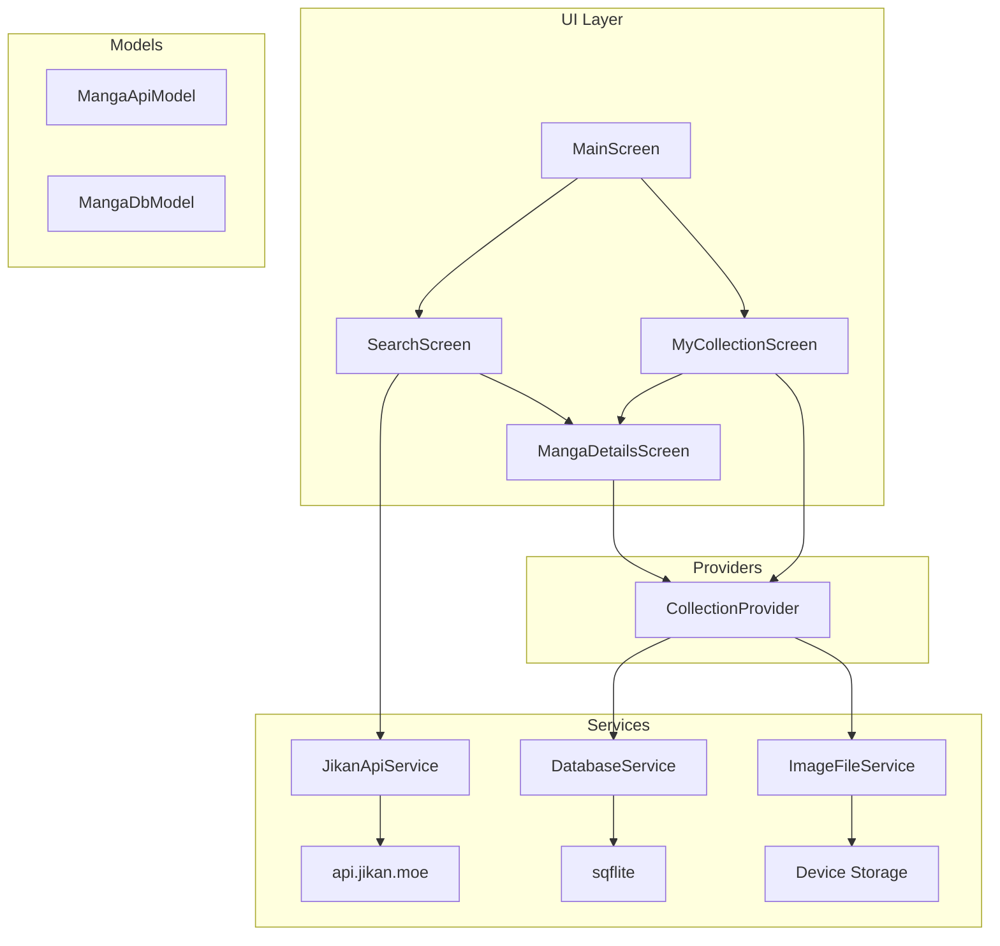

# 📚 Manga Collector — Flutter App


> A **Flutter app** that lets you explore and collect manga using the [Jikan.moe API](https://jikan.moe/).
> Search, browse, view details, and build your own **offline manga collection** — complete with personal notes, reading status, and scores.

---

## 🖼️ Screenshots

> Add your app screenshots here to visually showcase your UI.

|                 Home / Search                 |                    Details                    |                 My Collection                 |
| :-------------------------------------------: | :-------------------------------------------: | :-------------------------------------------: |
|  |  |  |


---

## 🚀 Overview

**Manga Collector** demonstrates full-stack mobile development in Flutter —
from **API integration** to **offline persistence** — through a clean, production-style architecture.

**Highlights:**

* 🌐 API Integration — Jikan.moe REST API
* 🧠 State Management — `provider`
* 💾 Offline Support — SQLite + Local Images
* 🖼️ Grid/List Views — Toggle between display modes
* ⚙️ CRUD Operations — Full local control

---

## 🎯 Learning Objectives

By studying or extending this project, you’ll learn how to:

* Fetch and handle **API data** using `http`
* Parse **JSON** into Dart models
* Implement **pagination** and **debounced search**
* Persist **data and images** locally using `sqflite` + `dart:io`
* Manage **state** with `ChangeNotifier` & `provider`
* Organize code into **UI / Provider / Services / Models**
* Build responsive **Flutter UIs** (ListView, GridView)
* Add **filters**, **sorters**, and **offline viewing**

---

## ⚙️ Core Features

| # | Feature                     | Description                           |
| - | --------------------------- | ------------------------------------- |
| 1 | 🔝 **Browse Popular Manga** | View top manga with infinite scroll   |
| 2 | 🔍 **Search Manga**         | Find titles using Jikan API           |
| 3 | 📖 **Manga Details**        | View synopsis, score, and type        |
| 4 | ➕ **Add to Collection**     | Save manga locally with user notes    |
| 5 | ✏️ **Edit Data**            | Update score, status, and notes       |
| 6 | ❌ **Delete Manga**          | Remove from DB and delete image       |
| 7 | 📴 **Offline Access**       | Access collection without internet    |
| 8 | 🧩 **Filter / Sort**        | Filter by status, sort alphabetically |
| 9 | 🔄 **View Toggle**          | Switch between list & grid views      |

---

## 🧠 Architecture Overview

### Layered Structure

```
lib/
 ├── models/        # Data models (API + DB)
 ├── services/      # API + Database logic
 ├── providers/     # State management (Provider)
 ├── screens/       # UI Pages
 ├── widgets/       # Reusable UI components
 └── main.dart      # Entry point
```

### Mermaid Diagram



🧩 **Flow Summary:**
UI → Provider → Services → Models → SQLite
Images are cached locally and loaded from disk when available.

---

## 🗃️ Data & API Layers

### Jikan API Integration (`jikan_api_service.dart`)

* Endpoints: `/top/manga`, `/manga`
* Handles search, pagination, and errors
* Converts responses → `MangaApiModel`

### SQLite Database (`database_service.dart`)

* DB: `manga_collection.db`
* Fields include: `id`, `title`, `status`, `score`, `local_image_path`
* CRUD via `sqflite`

### Image Management (in `collection_provider.dart`)

* Downloads cover image using `http`
* Saves to documents folder (`path_provider`)
* Deletes image file upon manga removal

---

## 🧱 CRUD Operations

| Action    | Method                   | Description                  |
| --------- | ------------------------ | ---------------------------- |
| ➕ Add     | `addManga()`             | Insert manga and store image |
| 📖 Read   | `getAllManga()`          | Retrieve collection          |
| ✏️ Update | `updateManga()`          | Edit notes/status            |
| ❌ Delete  | `deleteMangaAndReturn()` | Remove DB entry + image      |

---

## 💡 Design Decisions

| Category          | Choice                 | Reason                  |
| ----------------- | ---------------------- | ----------------------- |
| 🧠 Framework      | Flutter (Dart)         | Cross-platform          |
| 🌐 API            | Jikan.moe + `http`     | Open & lightweight      |
| 💾 DB             | `sqflite`              | Full control            |
| 🖼️ Image Storage | Manual                 | True offline capability |
| 🔧 State          | `provider`             | Simple yet powerful     |
| ⚙️ Error Handling | `try/catch`, SnackBars | Smooth UX               |
| 🎨 UI             | Material Design        | Familiar look           |

> 💡 *Note:* `cached_network_image` could simplify caching,
> but local file control was chosen for **offline reliability**.

---

## 🧰 Tech Stack

| Layer    | Tools                     |
| -------- | ------------------------- |
| UI       | Flutter Widgets, Material |
| State    | Provider                  |
| API      | http, dart:convert        |
| Storage  | sqflite, path_provider    |
| Files    | dart:io, path             |
| Language | Dart                      |

---

## 📦 Deliverables

✅ Well-structured source code
✅ Functional offline demo
✅ Technical documentation (this README)
✅ UML-style architecture diagram

---

## 🧾 Evaluation Checklist

| Criteria             | Status                               |
| -------------------- | ------------------------------------ |
| 🧱 Architecture      | ✅ Clean & modular                    |
| 🧠 State Management  | ✅ Provider                           |
| 🌐 API Integration   | ✅ Pagination + search                |
| 💾 Offline Storage   | ✅ SQLite + images                    |
| 🎨 UI/UX             | ✅ Responsive + intuitive             |
| ⚙️ CRUD Logic        | ✅ Complete                           |
| 🧑‍💻 Code Practices | ✅ `const`, async/await, clear naming |

---

## 🧑‍🎓 Summary

> *"Manga Collector"* is a **hands-on learning project** designed for developers who want to master **Flutter**, **REST APIs**, and **offline-first architecture** — while building something fun and practical.


